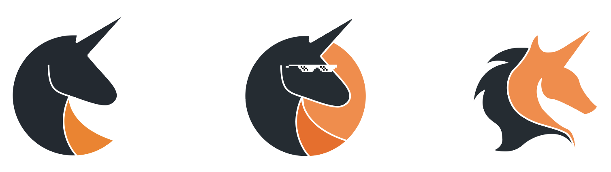

# Branding Documentation

This is a brief description of how we came about the logo design.

First off, our name contains "Illegal" so we ended up picking colors that were orange and black.

Once these colors were chosen, I then had to incorporate unicorn into the logo. This was the main idea of our team and we agreed that minimalism would look nice, so I went ahead and drafted several minimalistic unicorn figures, listed below:

We voted and decided on choosing the middle logo, which is what you see today.

Other features of the logo include the glasses, which I decided to add to further the "illegal" portion of our name.  
I also decided that adding two shades of orange would add some needed variety to the logo and break up the image.
