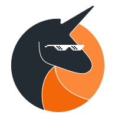

<h1 align="center">Team Contract</h1>
<h2 align="center"> Spring 2021 - CSE 110 </h2>
<h2 align="center"> 04/13/2021 </h2>

#### 1) Group 26: The Illegal Unicorns

| Team Member:      | Pronouns:	| Email: |Website: |
| ----------- | ----------- |----------- | ----------- |
| Alejandro C. Ramirez | He/Him/His |acramire@ucsd.edu| https://acramire.github.io/cse110/|
|Yujie Zhang  | She/her/hers|yuz876@ucsd.edu |https://yuz876.github.io/CSE110Lab1/ |
|Margarita Leonova|She/her/hers|mleonova@ucsd.edu|https://mleonova.github.io/CSE110_LAB1/ |
|Calvin Qin|He/Him/His|cqin@ucsd.edu| https://calvq.github.io/CSE110_lab1/ |
|Karan Sidhu|He/Him/His|ksidhu@ucsd.edu|https://karansidz.github.io/GitHubPagesProject/|
|Anoop Gunawardhena|He/Him/His|agunawar@ucsd.edu|https://anoop-gunawardhena.github.io/Pages/|
|Joshua Santillan|He/Him/His|jsantill@ucsd.edu|https://joshuasantillan.github.io/CSE110_Lab1/|
||

#### 2) Primary Means of Communication and Expectations

 Our team’s primary form of communication is through our Slack channel. Each team member is expected to: keep up with what is said in the channel daily and respond when necessary. Each team member is also expected to conduct themselves appropriately and respectfully while using Slack.

#### 3) Scheduling Meetings (Schedule at least one meeting as part of constructing your team agreement.)

When necessary, the team will agree to set up a meeting time through the slack channel. A team member will make a When2Meet to narrow down the best times for the team members expected to attend the meeting. Additionally, at the end of every meeting the meeting’s attendees will discuss whether an additional meeting is necessary, if so, the team will agree upon another meeting time.

Each team member is expected to attend meetings they are scheduled for in a timely manner. If an unexpected situation arises in which a team member will not be able to attend or will be more than 5 minutes late, they are expected to notify the team as soon as possible via Slack.

#### 4) General Responsibilities for All Team Members
Each team member is expected to:  
1. Seek help when they need it. (Don’t be afraid to ask for help!)

	* team members should be open to helping their teammates whenever they are able to

2. Complete/work on items the member is in charge of in a timely manner  
	* If they are no longer able to complete it with the previous timeline, they are expected to communicate that with the team/team leaders.

3.  Be respectful and professional
    
4.  Communicate when necessary
    

	* Conflict, general problems, being late, etc.

5. Be open minded to other viewpoints/ideas

#### 6) Conflict Resolution

In the case that a team member is not meeting deadlines, the team leaders should be the first notified. The team leaders should then decide on a course of action. Depending on the urgency and frequency of the matter, the team leaders should first talk with involved team member(s) and then later contact Deepak (TA) if necessary.

#### 7) Team Signatures
1.  Alejandro C. Ramirez - 04/15/21 - X___________________
    
2.  Yujie Zhang - 04/15/21 - X___________________
    
3.  Margarita Leonova - 04/15/21 - X___________________
    
4.  Calvin Qin - 04/15/21 - X___________________
    
5.  Karan Sidhu - 04/15/2021 - X___________________
    
6.  Anoop Gunawardhena - 04/15/2021 - X___________________
    
7.  Joshua Santillan - 04/15/202 - X___________________
