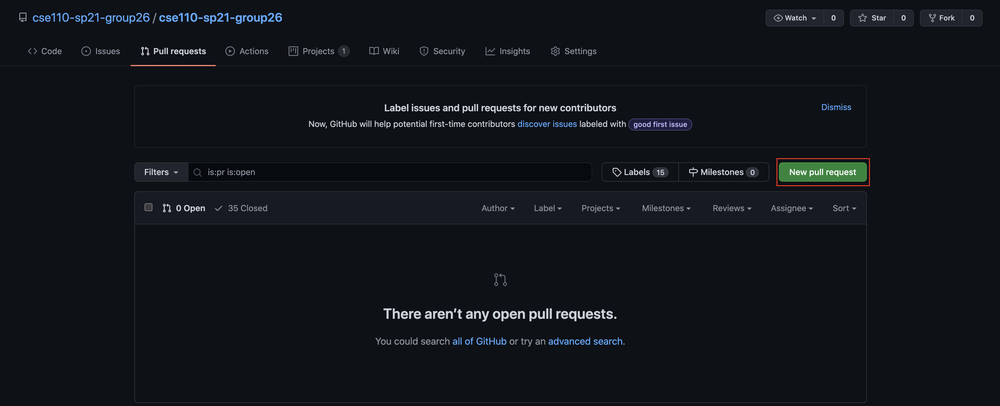
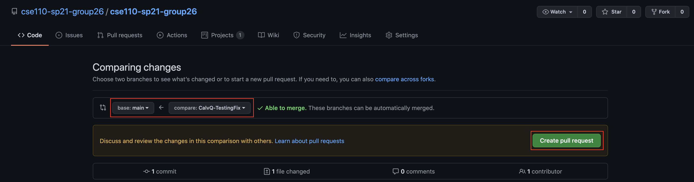
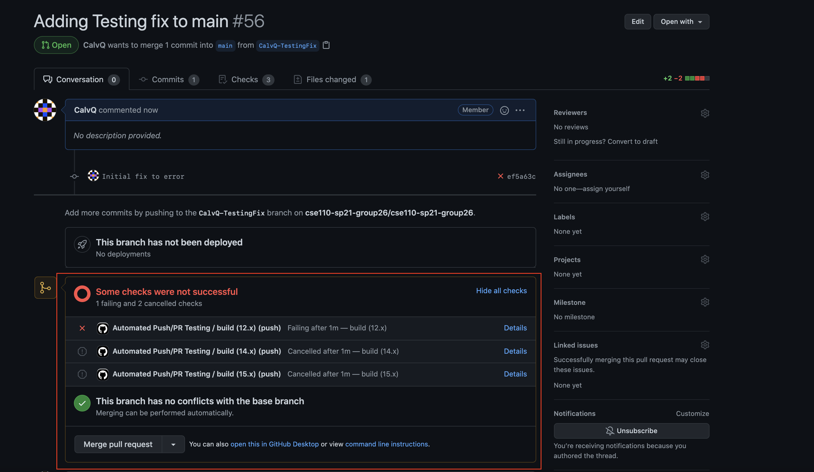
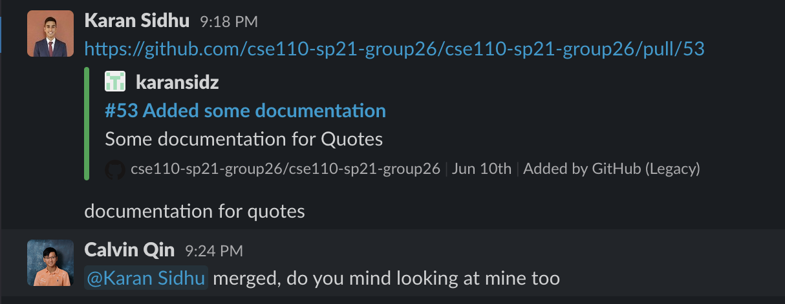
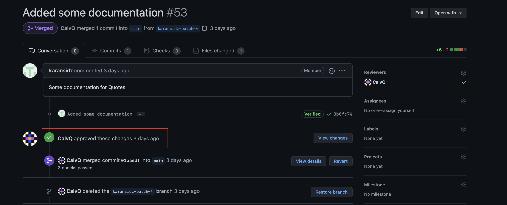

# Illegal Unicorns Onboarding Document

## First Clone for the Repository

To start, clone our repository from our main repository at this link: https://github.com/cse110-sp21-group26/cse110-sp21-group26.git.  
You can do this using the command `git clone https://github.com/cse110-sp21-group26/cse110-sp21-group26.git`.

## Development and Deployment

When we develop code, ensure that you are branching off of `main` and using your own branch.  
This ensures that each feature can be integrated later down the line without conflicting with other componenets.

You should name your branch `name-feature` to make the purpose of your branch clearer. For example, if user `CalvQ` wants to create a branch developing `stickynotes`, then the branch should be named `CalvQ-stickynotes`.

All pushes to the repository run automated tests. Ensure that before you make a pull request, your tests pass. Otherwise make sure that you fix your code so that the tests pass before making a pull request.  
Also before you create a pull request, first merge `main` branch into your branch. This is done by first commiting all of your changes to your branch.  
Then, run these commands:

```
git checkout main
git pull
git checkout your-branch
git merge main
```

Afterwards, fix any merge conflicts if there are any. Once these conficts are fixed, you can create your pull request.

To create a pull request, first go to Github and create a pull request:



Make sure the automated tests pass:


Then mention in the #pr_review-comments Slack channel that you have a new pull request that needs to be reviewed:


Only when a pull request has at least one review by one other person can you, or someone else, merge that pull request:


## Testing Frameworks

Our testing framework runs based on `Jest` and `Puppeteer`. To run these tests, make sure that you have `npm` installed.

To test this, run `npm -v`. If you get an error, install `npm` at this link: https://www.npmjs.com/get-npm.

After each push to the github repository, the tests that are written will automatically be run for you. However, if you want to run your tests locally then you can also do so by running `npm test` in the `source/` directory.

## Code Styling and Documentation

Our styling is done using a VS Code extension called Prettier, found at this link: https://marketplace.visualstudio.com/items?itemName=esbenp.prettier-vscode.
The settings by default are what we use for our code styling.

Our documentation is also done using JSDoc.

Ensure that your code is styled and documented before creating a pull request.
